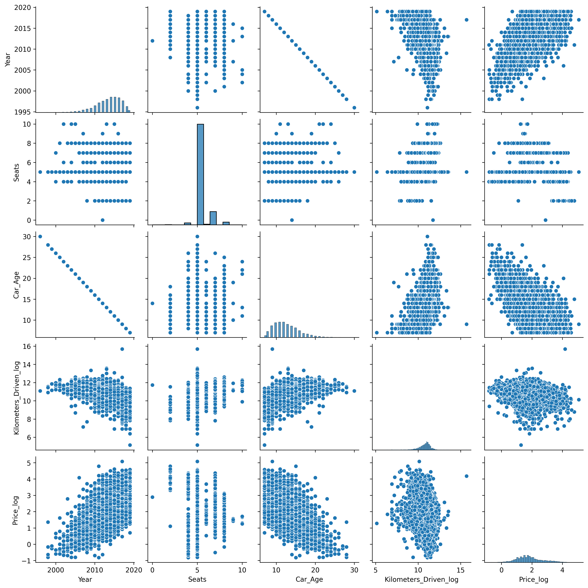

# 🚗 Used Car Price Analysis & Prediction

## 📌 Project Overview

This project focuses on **Exploratory Data Analysis (EDA), Data Cleaning, Feature Engineering, and Data Preparation** on a Used Cars dataset to understand the factors affecting car prices.

The goal is to analyze real-world car data and identify how different features such as **car age, fuel type, transmission, brand, mileage, engine power, and ownership** influence the price of used cars.

---

## 🎯 Objectives

* Understand dataset structure and quality
* Perform data cleaning and preprocessing
* Create meaningful features using feature engineering
* Perform **Univariate, Bivariate, and Multivariate Analysis**
* Visualize patterns affecting car prices
* Handle missing values using domain-based imputation
* Prepare data for machine learning modeling

---

## 📂 Dataset

* File: `used_cars_data.csv`
* Contains information about:

  * Car Name
  * Year of manufacture
  * Location
  * Fuel Type
  * Transmission
  * Owner Type
  * Mileage
  * Engine
  * Power
  * Seats
  * Price

---

## 🛠️ Technologies Used

* Python
* Pandas
* NumPy
* Matplotlib
* Seaborn
* Jupyter Notebook
* Git & GitHub

---

## ⚙️ Project Workflow

### 1️⃣ Data Understanding

* Loaded dataset
* Checked shape, data types, and missing values
* Identified data inconsistencies

### 2️⃣ Data Reduction

* Removed unnecessary columns (`S.No.`)

### 3️⃣ Feature Engineering

* Created **Car_Age** from manufacturing year
* Extracted **Brand** and **Model** from car name

### 4️⃣ Data Cleaning

* Corrected inconsistent brand names
* Fixed incorrect entries

### 5️⃣ Exploratory Data Analysis (EDA)

#### ✔ Univariate Analysis

* Histograms
* Boxplots
* Countplots

#### ✔ Bivariate Analysis

* Pairplots
* Category vs Price comparisons

#### ✔ Multivariate Analysis

* Correlation Heatmap

### 6️⃣ Data Transformation

* Applied **log transformation** to handle skewed features:

  * Price
  * Kilometers Driven

### 7️⃣ Missing Value Imputation

* Mileage → Mean value
* Seats, Engine, Power → Median based on Brand & Model

---

## 📊 Key Insights

* Newer cars have higher prices.
* Automatic transmission cars are generally more expensive.
* Diesel cars dominate the dataset.
* First-owner cars have higher resale value.
* Engine and Power show strong positive correlation with price.
* Car age negatively impacts price.

---

## 📁 Project Structure

```
Used-Car-Price-Prediction/
│
├── used_car_analysis.ipynb
├── used_cars.csv
├── README.md
└── plots/
    ├── correlation_heatmap.png
    ├── pairplot.png
    ├── categorical_countplots.png
    └── univariate_*.png
```

---

## ▶️ How to Run the Project

1. Clone the repository:

   ```bash
   git clone https://github.com/yourusername/Used-Car-Price-Prediction.git
   ```

2. Install required libraries:

   ```bash
   pip install pandas numpy matplotlib seaborn
   ```

3. Open Jupyter Notebook:

   ```bash
   jupyter notebook
   ```

4. Run `used_car_analysis.ipynb`

---

## 📸 Sample Outputs




---

## 👩‍💻 Author

**Richa Sharma**
B.Tech IT
Interested in Data Science, Machine Learning & Data Analytics

---

## ⭐ Future Improvements

* Apply Machine Learning models for price prediction
* Hyperparameter tuning
* Model comparison and evaluation

---

## 📜 License

This project is created for educational and learning purposes.
